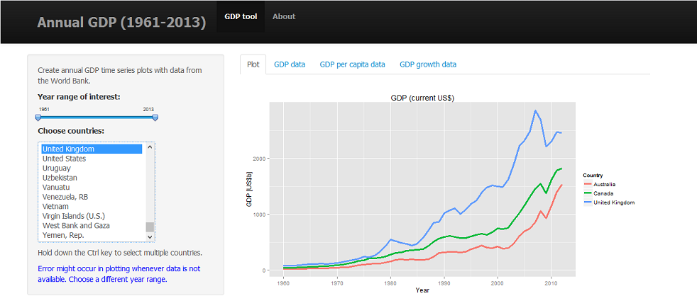

Coursera Developing Data Products 
========================================================
author: Tan, Kok Meng
date: November 20, 2014
transition: rotate

RStudio Presentation: GDP tool


Overview
========================================================
The GDP tool allows the user to visualize how annual GDP changes for any year 
range between 1961 and 2013 and for any set of countries selected by the user.

The app also computes the average annual GDP growth for the specified year range.

This application is based on the World GDP data obtained from the website: 
http://data.worldbank.org/indicator/


Average GDP growth
========================================================
The average annual growth [%] is
$$ r = 100 \left[ \left( \prod_{i=t_1}^{t_n} (1+r_i/100) \right)^{1/n} - 1 \right] $$
where $r_i$ is the growth rate [%] for year $i$.

For instance, the average annual growth for rates `r` is

```r
r <- c(0.465, 0.383, 2.296, 2.445, 3.394)
r <- r/100+1
n <- length(r)
cumul <- 1
for (i in 1:n){cumul <- cumul*r[i]}
round((cumul^(1/n)-1)*100, digits=2)
```

```
[1] 1.79
```


Screenshot of App
========================================================

The user can also view the data that is used in plotting in the Data tabs.


Check it out now!
========================================================
The app is available in shinyapps:
http://kesamet.shinyapps.io/GDPtool

The code is available in github: 
https://github.com/kesamet/DataProducts
